Tail slapping, tail flipping, breaching, waving, lobtailing, blowing, no we are not talking about some whale show where imprisonned animals are kept in captivity for humans to have fun. But we are talking about observing whales in their natural habitat, from a safe distance (for them), respecting their bounders and hoping for the best show available based on their motivation.

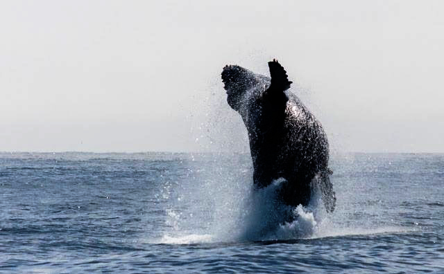

This is what you can expect from a whale watching tour in California. There are probably multiple companies around providing these services but in the end all of them take you to the same place, the Monterey bay.

From april to november the chances are much higher to get a glimpse of these incredible sea animals. The bay is home to one of the largest and deepest submarine canyons hence providing an abondance of food for the whales to feed. We managed to see quite a few humpback whales and two blue whales! The chances for finding out the blue whales are slim but we were quite lucky and amazed by the sizes.

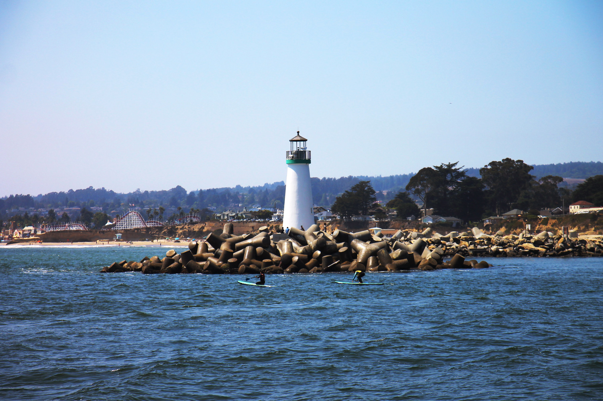

# Humpback whale

They are the most playfull ones when in the mood since they play with their tails, fins and even breach. Sitting at the front side of the boat gave us the ability to observe the horizon trying to find them. There are different ways to look for them (apparently):

* getting signals from other boats about their whereabouts (the least interesting one albeit important)

* looking at the sea for any tails and fins moving although it is way harder since the moves are spontaneous and fast

<photo-composition>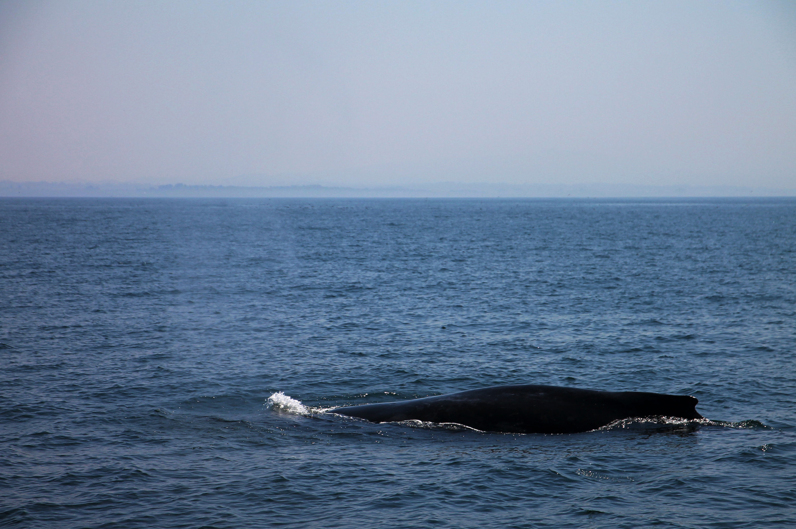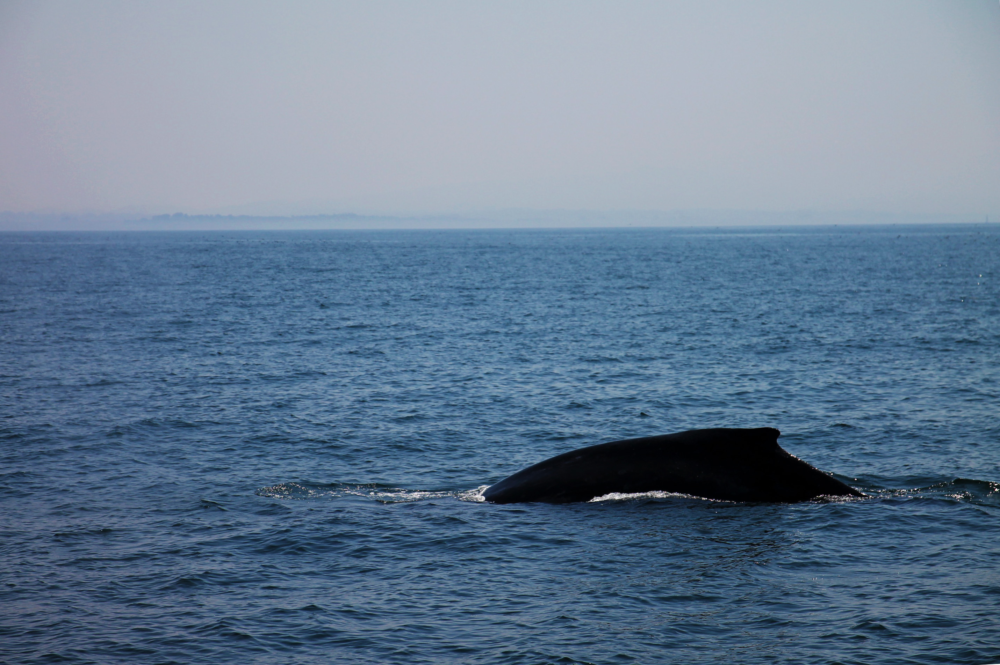</photo-composition>

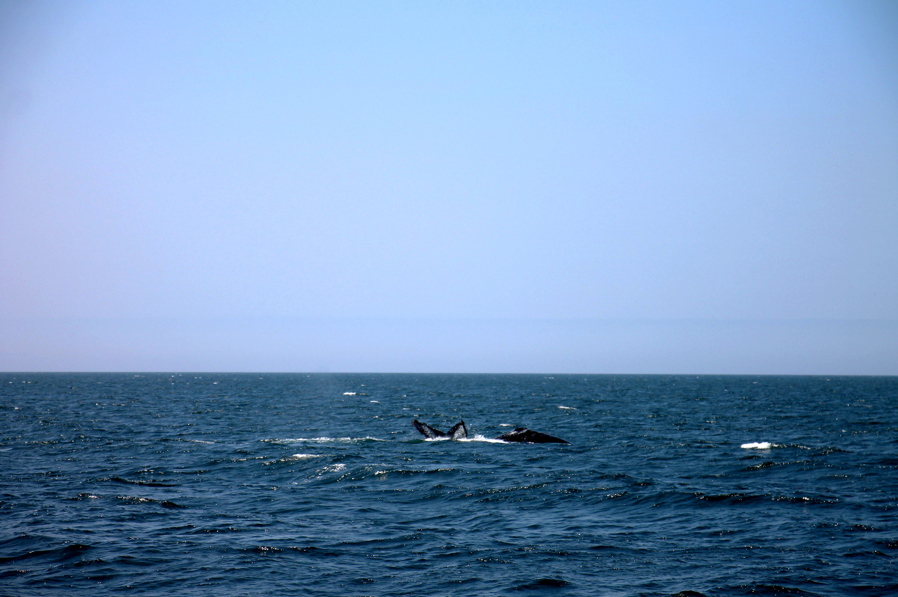
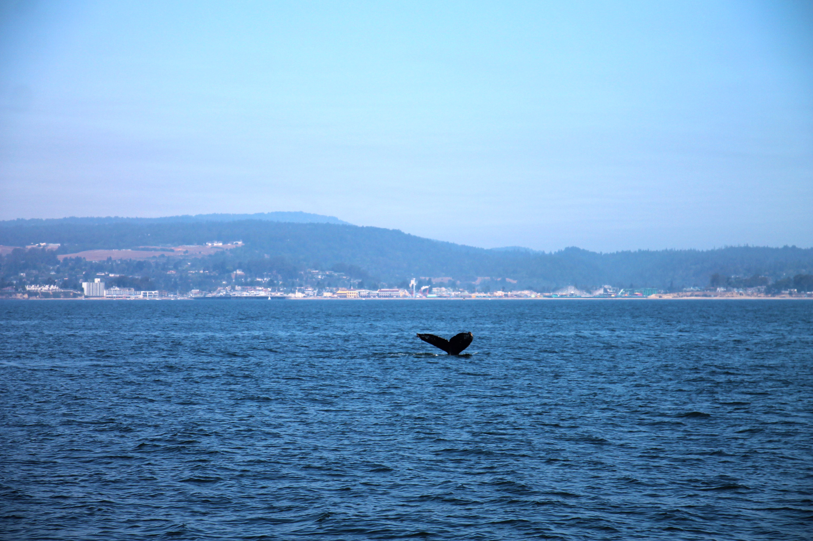

* trying to see blows of water up in the air. They blow water every 5 minutes and this was the easiest way

* from the smell. They are animals and they pee and poo as we do. Only difference? It smells even more and from further distance!

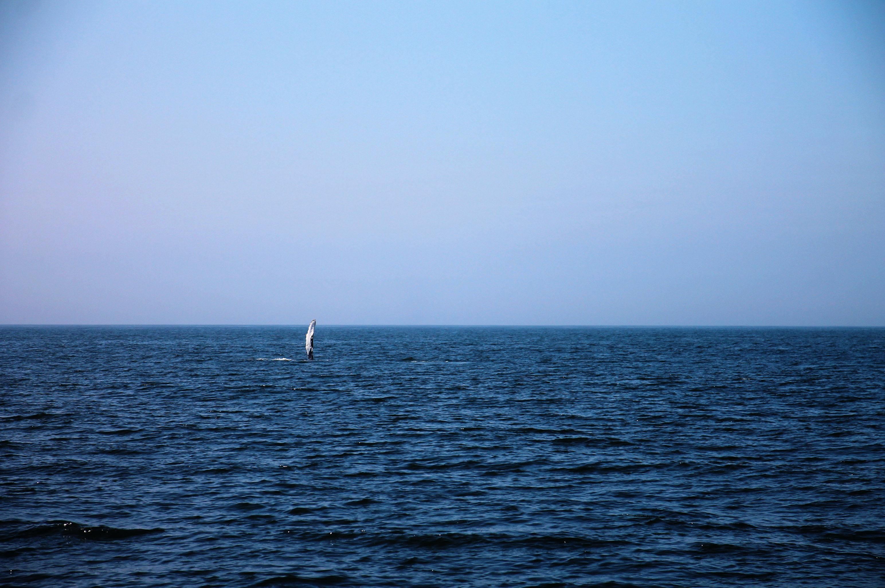

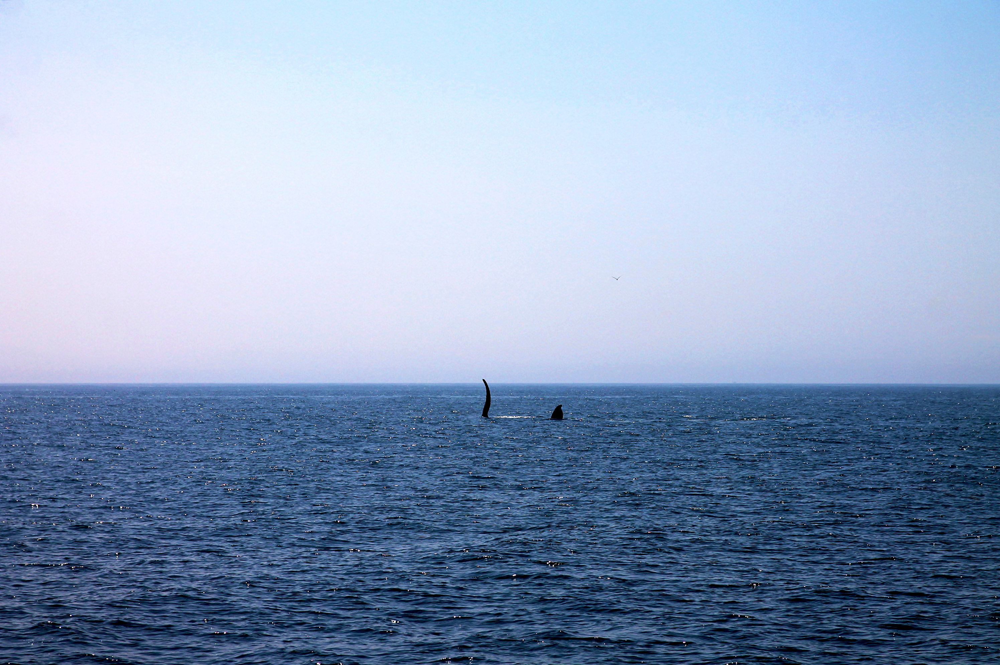

<video width="100%" controls muted>
  <source src="slapping-1.mp4" type="video/mp4">
</video>

# Blue whales

These gigantic mammals are huge. They are probably 3 or more times the size of the humpback whale which are already quite big. Being enormaous, they don't spend much time above the sea. We managed to see only a small portion of their body when they were getting air and it was incredible. What's most impressive is when they blow air. It goes up way heigher than the others and with the most spectacular sound.

<photo-composition>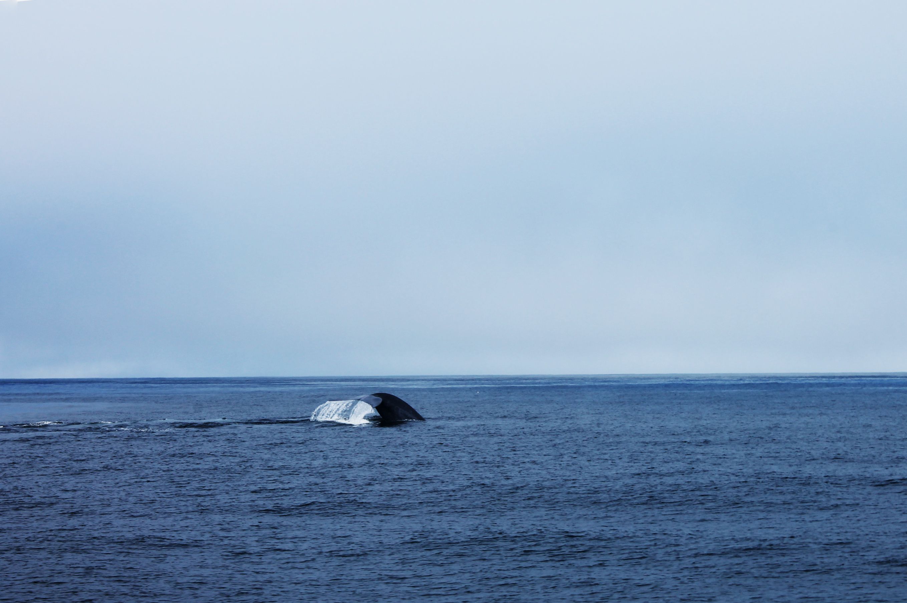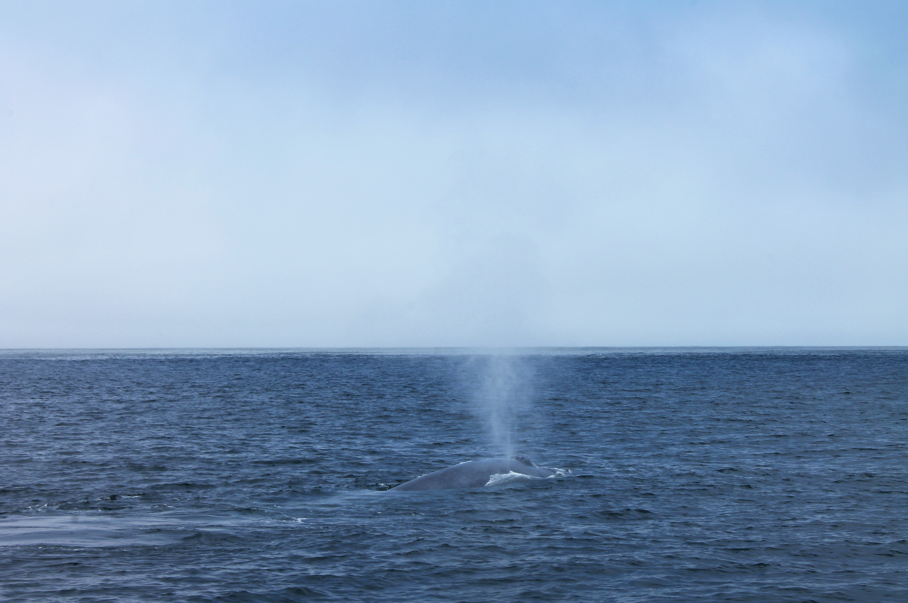</photo-composition>

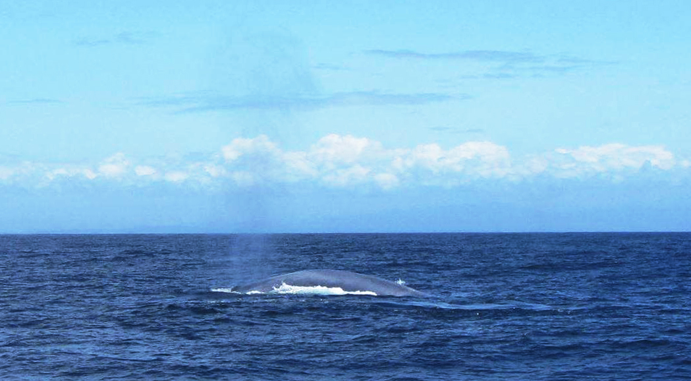

# In search for more

Taking on these kind of tours lets you crave for more. We wanted to see some killer whales as well but we were unlucky and probably in the wrong period.

What we loved about the tour was that we also got to see tons of other animals. There are many jellyfish of different colors, seals and even great white sharks. Birds are constantly flying above the boats, and even oatters are settling in the area.

The bay has so much life it is probably impossible to leave unhappy from these kind of tours since the chances of finding out whales and other sea life animals are quite high, especially at the right period.

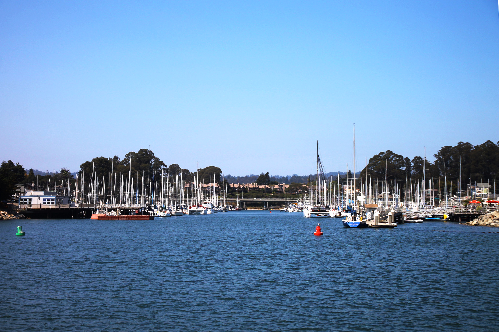
